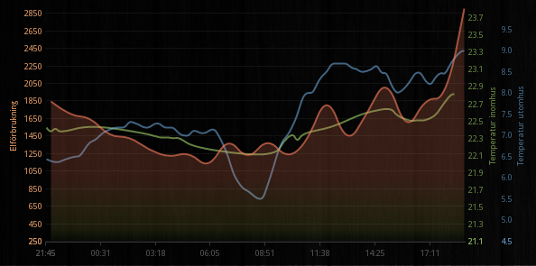

Grapho
======

Grapho is a dependency free data visualisation library for JavaScript, written with the KISS principle in mind.

Features
======
  * Single file, only 15KB minified
  * Works great on it's own, but is compilant with the AMD+/Require.js, Fandango etc.
  * Dependency free
  * Highly customizable
  * Using HTML5 canvas
  * Reizable - automically adapts to parent div dimensions
  * Capable of rendering graphs in real time, 60fps if you like
  * Works great on mobile devices
  * Custom themes
  * Predefined themes
   * Dark
   * Light
  * Chart types
    * Bar (Stacked, Fixed)
    * Line (Stacked, Fixed)
    * Area (Stacked, Fixed)
    * Scatter
    * Pie (Stacked, Regular)
    * Bands
    * Error bars
    * Box plot
    * Candle
    * OHLC
  * MIT licensed, free to use everywhere, everytime.

Contributing
======
You can contribute in any way you like! Fork it, report bugs, or just plain use it.

Examples & Documentation
======
Available at http://hexagon.github.io/grapho
